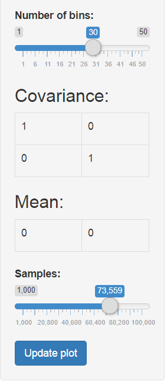

```{r setup, include=FALSE}
knitr::opts_chunk$set(echo = FALSE)
```

## Visualizing two-dimensional normal distributions

Have you ever wondered what a two-dimensional normal distribution might look like?

I know I have!

Now there's **THE** app that will answer that question. Introducing

[**the two-dimensional normal distribution web app**](https://bettmensch88.shinyapps.io/normal_distribution/)

(or *"ttdndwa"* for short)

## Parameters

It's got everything!

- two dimensional mean: set the center of your distribution!
- 2x2 covariance matrix: control the correlation of both axes by setting this matrix!
- number of bins: have a direct say in how granular the visuals should be!
- number of samples: tired of having too high/low sampling counts? Now you can directly specify your favourite number!

## Plots

Look at this plot! Just look at it!

```{r,include=FALSE}
library(plotly)
library(tidyverse)
```

```{r}
n_sample <- 10000
mean <- c(0.4,-3)
covariance <- matrix(c(1,0,0,1),ncol = 2)
bins <- 20

# sample the data according to specs
    normal_data <- compositions::rnorm.rmult(n_sample,
                                             as.numeric(mean),
                                             covariance) %>%
      as.data.frame() %>%
      magrittr::set_colnames(c('x','y'))
    
    # create 2 dim buckets
    x_bins <- seq(min(normal_data$x)-0.01, max(normal_data$x)+0.01, length.out = bins + 1)
    y_bins <- seq(min(normal_data$y)-0.01, max(normal_data$y)+0.01, length.out = bins + 1)
    
    x_bin_matrix <- c(x_bins[1],rep(x_bins[2:(length(x_bins)-1)],each=2),x_bins[length(x_bins)]) %>%
      matrix(ncol = 2,byrow = TRUE)
    
    y_bin_matrix <- c(y_bins[1],rep(y_bins[2:(length(y_bins)-1)],each=2),y_bins[length(y_bins)]) %>%
      matrix(ncol = 2,byrow = TRUE)
    
    # create bucket column in data set
    normal_data$x_bin <- apply(x_bin_matrix, 1,findInterval,x=normal_data$x) %>%
      apply(1,function(x){which(x==1)}) %>%
      unlist()
    
    normal_data$y_bin <- apply(y_bin_matrix,1,findInterval,x=normal_data$y) %>%
      apply(1,function(x){which(x==1)}) %>%
      unlist()
    
    # create labels for plots
    x_label <- x_bin_matrix %>%
      as.data.frame() %>%
      lapply(function(x){round(x,2)}) %>%
      do.call(cbind,.) %>%
      as.data.frame() %>%
      dplyr::mutate(label = stringr::str_c('[',.$V1,',',.$V2,')')) %>%
      dplyr::pull(label)
    
    y_label <- y_bin_matrix %>%
      as.data.frame() %>%
      lapply(function(x){round(x,2)}) %>%
      do.call(cbind,.) %>%
      as.data.frame() %>%
      dplyr::mutate(label = stringr::str_c('[',.$V1,',',.$V2,')')) %>%
      dplyr::pull(label)
    
    # aggregate data to interval counts and plot
    temp <- normal_data %>%
      dplyr::select(x_bin,y_bin) %>%
      dplyr::group_by(x_bin,y_bin) %>%
      dplyr::summarise(bin_count = dplyr::n()) %>%
      dplyr::ungroup() %>%
      tidyr::spread(y_bin,bin_count) %>%
      dplyr::select(-x_bin)
    
    replace_missings <- rep(0,ncol(temp)) %>% as.list %>% purrr::set_names(colnames(temp))
    
    normal_plot <- temp %>%
      tidyr::replace_na(replace_missings) %>%
      as.matrix(ncol = nrow(.)) %>%
      plotly::plot_ly(z = .) %>%
      plotly::add_surface(x = x_bins, y = y_bins)
    
normal_plot
```

## Manual

|   |   |
|---|---|
| It's super easy to use. Simply specify the settings shown in the screenshot, and see the sampled frequencies change before your eyes! |  |

## Summing up

So what are you waiting for?! Visit [ttdndwa](https://bettmensch88.shinyapps.io/normal_distribution/) today and start plotting your own individual two dimensional normal distributions!

Remember:

- it's quick!
- it's easy!
- and it's free!

You'd be ***crazy*** not to!